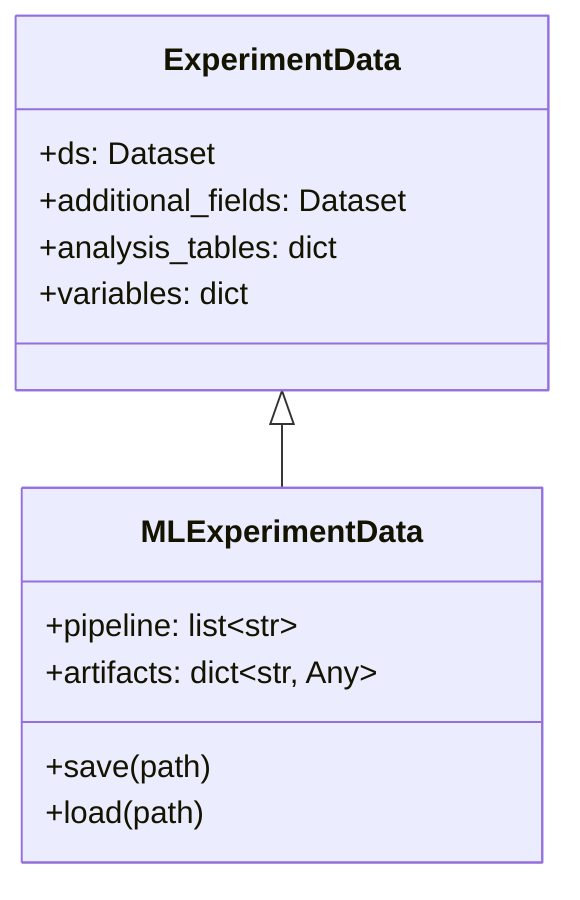
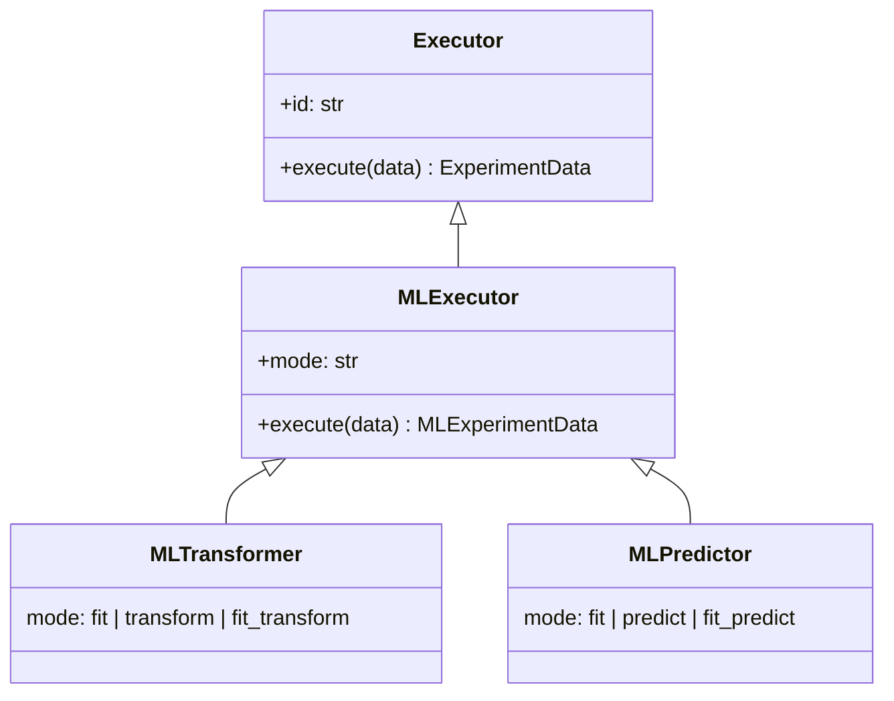
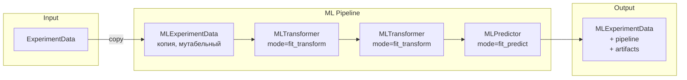
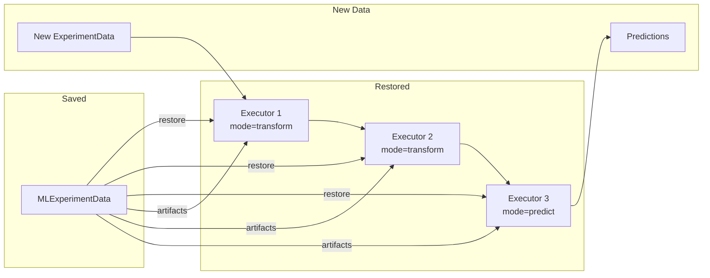

# ML Pipeline Concepts

Концептуальная модель ML-поддержки в HypEx.

## Обзор

ML pipeline отличается от статистических Executor'ов наличием **состояния** после обучения. Ключевое решение: состояние хранится в данных, а не в Executor'ах.

## Новые абстракции

### MLExperimentData

Наследник `ExperimentData` с расширениями для ML:



**Поля:**
- `pipeline: list[str]` — упорядоченный список ID выполненных Executor'ов
- `artifacts: dict[str, Any]` — fitted объекты по ID Executor'а

**Особенности:**
- Создаётся как **копия** исходных данных
- **Мутабельный** внутри pipeline (для эффективности)
- Поддерживает **сохранение/загрузку** с диска

**Пример:**
```python
data.pipeline = ['NaFiller╤aaa╤', 'Scaler╤bbb╤', 'RandomForest╤ccc╤']

data.artifacts = {
    'Scaler╤bbb╤': fitted_scaler,
    'RandomForest╤ccc╤': fitted_model,
    # NaFiller нет — он stateless
}
```

### MLExecutor

Базовый класс для ML Executor'ов. Наследует от Executor.



**Параметры:**
- `mode` — режим работы, задаётся при создании

**Поведение execute:**
- Сохраняет артефакт в `data.artifacts[self.id]` (если есть)
- Регистрирует себя в `data.pipeline`

### MLTransformer

Executor для преобразования данных (scaler, encoder и т.д.).

**Режимы:**
- `fit` — обучение, сохраняет артефакт
- `transform` — применение, читает артефакт
- `fit_transform` — обучение + применение

### MLPredictor

Executor для моделей (классификация, регрессия и т.д.).

**Режимы:**
- `fit` — обучение, сохраняет артефакт
- `predict` — предсказание, читает артефакт
- `fit_predict` — обучение + предсказание

## Поток данных



## Восстановление Pipeline

Pipeline можно восстановить из MLExperimentData:

1. Из `pipeline` получаем порядок ID
2. По ID восстанавливаем Executor'ы (класс + параметры)
3. Из `artifacts` достаём fitted состояние
4. Применяем к новым данным с `mode=transform/predict`



## Связь с существующей архитектурой

| Существующее | ML-расширение |
|--------------|---------------|
| ExperimentData | MLExperimentData |
| Executor | MLExecutor |
| Calculator | MLTransformer, MLPredictor |
| analysis_tables | artifacts |
| — | pipeline |

Принципы сохраняются:
- Единый интерфейс `execute(data) → data`
- Идентификация по ID
- Результаты по ID Executor'а
- Композируемость
